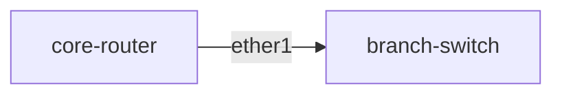

# topo-map

Auto-generate a network topology diagram from RouterOS's own neighbor discovery (`/ip neighbor
print`, MikroTik's equivalent of CDP/LLDP) — no manual documentation to keep in sync with reality.

## Installation

```sh
pip install -r requirements.txt
```

## Usage

```sh
cp inventory.example.json inventory.json   # fill in your devices
python topomap.py inventory.json --mermaid topology.mmd
```

Paste the contents of `topology.mmd` into anything that renders Mermaid (GitHub markdown, GitLab,
Obsidian, the [Mermaid Live Editor](https://mermaid.live)):



Neighbor discovery is symmetric — each link is normally seen from both ends — so `topo-map`
deduplicates them into one edge automatically.

Other output modes:

```sh
python topomap.py inventory.json --json    # raw edge list as JSON
python topomap.py inventory.json           # plain text: "core-router --[ether1]--> branch-switch"
```

## Notes

- Only devices reachable via SSH and listed in `inventory.json` are queried directly, but their
  RouterOS neighbor tables will show *any* neighbor-discovery-capable device on the same segment —
  including ones not in your inventory — so the map can surface more than what you listed.
- A router with neighbor discovery disabled on an interface won't show up from that side; the
  dedup logic still works fine as long as at least one side reports the link.

## Running the tests

```sh
python -m unittest discover -s tests
```

## License

MIT — see [LICENSE](LICENSE).
